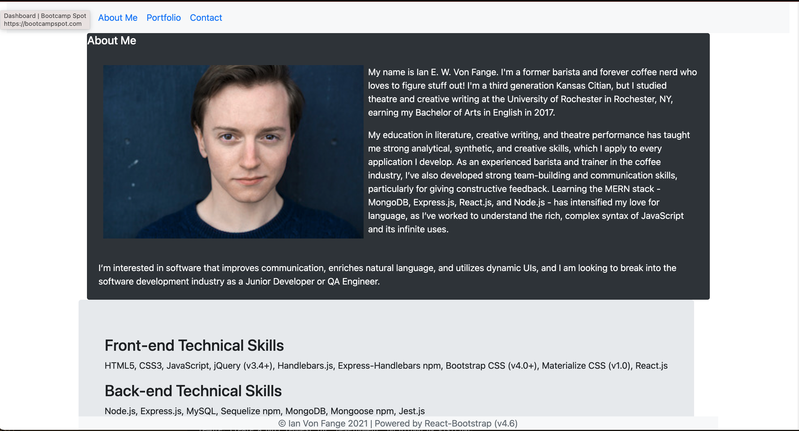

# React Portfolio

This project was bootstrapped with [Create React App](https://github.com/facebook/create-react-app).

## Description

My GitHub User page built entirely using React! This application showcases my skills with React as well as highlights of my development portfolio, and includes a contact page
with an email server hosted by Google.

## Development

Developed with React.js (v17.0.2), this application utilizes functional components, the useEffect hook, a HashRouter, and a projects.js data file iterated over using React to render each project highlighted on the Portfolio page. Feel free to reach out with any questions!

## Deployment

This application is deployed as a GitHub User page using GitHub pages, and can be viewed at https://eliaswolfgang.github.io/#/.

## Screenshot

## Learn More

You can learn more in the [Create React App documentation](https://facebook.github.io/create-react-app/docs/getting-started).

To learn React, check out the [React documentation](https://reactjs.org/).

